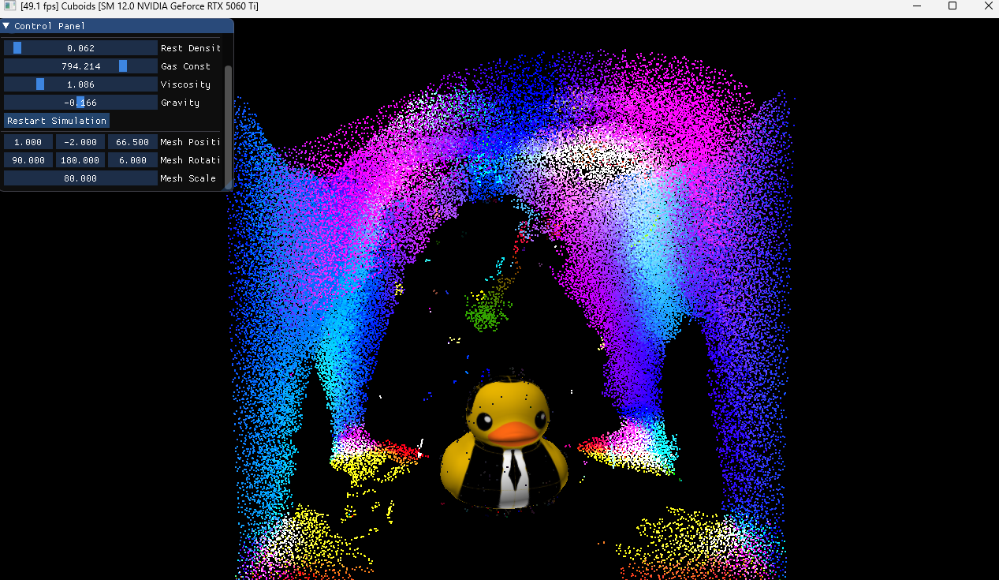
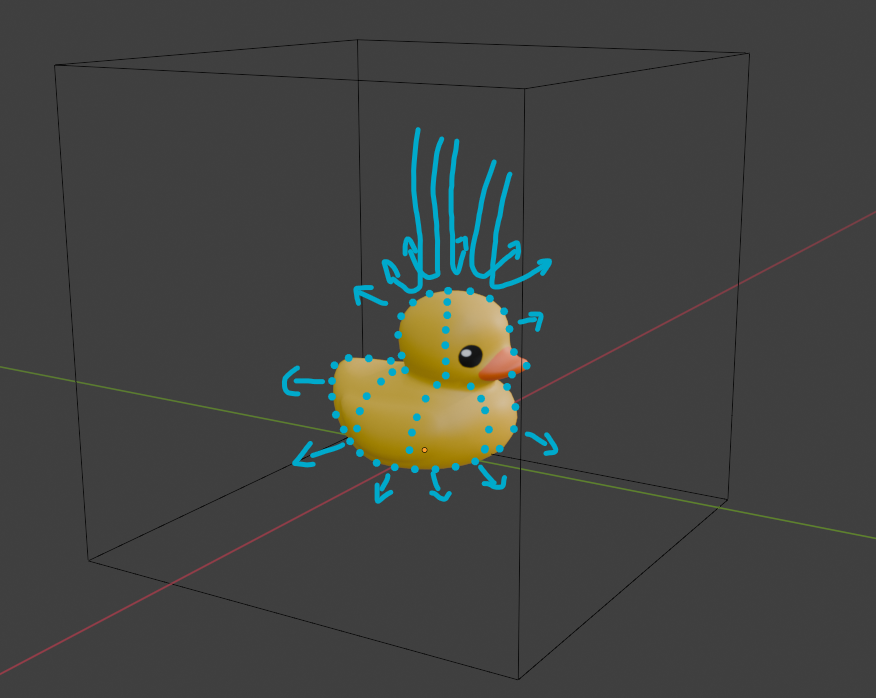
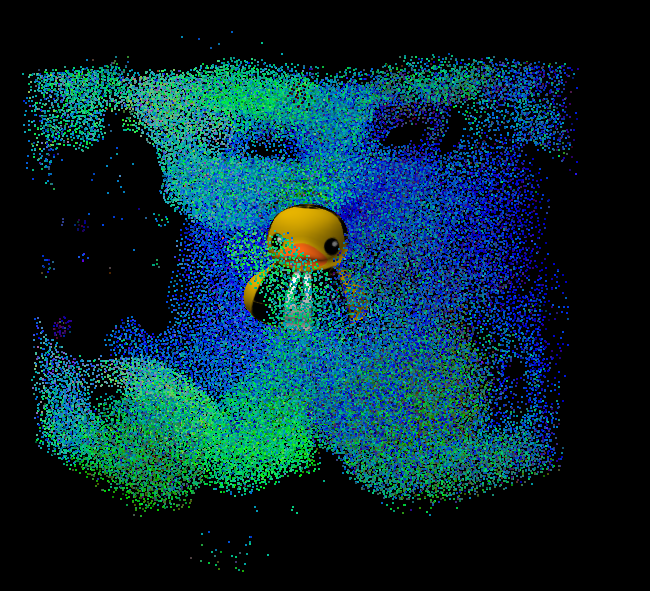

# CuBoids


Simulating Boids and Fluids (fairly) efficiently on CUDA

## 1. Boids


Our goal is to simulate the behavior of flocking boids whos movement follows three simple rules:
1. Rule 1: (Cohesion) Boids try to fly towards the centre of mass of neighbouring boids.
2. Rule 2: (seperation) Boids try to keep a small distance away from other objects (including other boids).
3. Rule 3: (alignment) Boids try to match velocity with near boids.

That is, the behavior of every boid is dependent on its neighbors. Our goal is to find a method to find these neighbors efficiently to avoid an expensive (N^2) calculation
The Naive solution does the following:
```
For each boid b1
    for each other boid b2
        for each of the three rules
            check if distance (b1,b2) < the distance threshold for each rule
                apply the rule and update b1's velocity accordingly
```

## 2. Fluids (SPH)
For fluid simulation, we use Smoothed Particle Hydrodynamics (SPH) - a Lagrangian method that discretizes fluid into particles, where each particle represents a small volume of fluid. In a nutshell, we update the particles based on the assumption that fluid properties (density, pressure) at any point are computed by smoothing contributions from neighboring particles using a weighted kernel function.

This is done using the following three kernels in order

Kernel 1: Density and Pressure
```
For each particle:
    density = selfDensity
    For each neighbor within 27 surrounding cells:
        if distance² < h²:
            density += mass * (h² - distance²)³
    pressure = gasConst * (density - restDensity)
```

Kernel 2: Forces
```
For each particle:
    force = 0
    For each neighbor within 27 surrounding cells:
        if distance² < h²:
            // Pressure: repels from high density areas
            force += direction * pressureForce
            
            // Viscosity: damps relative velocity
            force += viscosity * velocityDifference
    forces[idx] = force
```

Kernel 3: integration
```
For each particle:
    acceleration = forces / density + gravity
    velocity += acceleration * dt
    position += velocity * dt
    
    // Scatter back to original particle order for rendering
    positions_original[origIdx] = position
```

performing this on a massively parallel GPU gives an "okay" performance, but certainly does not make full use of it
The optimized procedure assumes a fixed grid size
procedure:
1. We divide the grid into N cells
2. We map each boid to the cell that it is currently in
3. we perform a key-value sort in parallel using `Thrust` where the key is the cell index and the value is the boid's index 
4. We can now efficiently determine the neighboring cells of each boid by selecting the 27 cells that encompass it
5. Now we apply the same three rules between the current boid and only the boids that are within the sorrounding 27 cells to this boid

Performing this immediately yeilds some 300x speed up. More importantly, our runtime is no longer quadratic so we can simulate much more boids before the simulation becomes too slow.

We can go a step further by ensuring memory accesses are coherent.
In our earlier procedure, we have seperate buffers. One to get the index of the boid, another to get the position of the Boid based on its index, and a third gets its velocity based on its index
This means that while our boid array is sorted, accessing a specific boid's velocity or position requires first getting its index from the index array
More importantly, these accesses are scattered across each buffer so we cannot make use of memory coalescing. (the GPU fetches a chunk of memory at a time)
to resolve this, we perform a shuffling step after sorting, which sorts the position and velocity buffers based on the already sorted index buffer. 

This also yeilds about a 1.5x speedup over our last optimization.

## 3. Ducky (Mesh Collision)
One way to handle mesh collisions would be to explicitly send the mesh to the kernel that performs position updates and test the mesh's triangles against every particle. Ofcourse that would be very expensive, we could make use of our spatial partitioning scheme to also sort the mesh's triangles into corrosponding cells, and only checking for each particle against the triangles in the same cell. 
But there's a cleaner approach. 
Instead of doing an explicit mesh vs particle collision test before we set the particles' final positios, we build a set of boundary particles around the mesh by sampling on its surface. Then we simply extend our particle buffer by these "Fake" boundary particles. These boundary particles can then go through the exact same pipeline as every other particle with the exception that their position/velocities do not get updated with the other particles. Also these particles are not sent to the VBO so they are not rendered. Effectively, we now have a forcefield sorrounding our mesh that repels particles away naturally according to the SPH update rule. For Boids, we modify rule 2 slightly but still retain the same code.



## 100k particles (SPH fluid) and a duck
[](https://youtu.be/W0XgQxDH7y0)



## 10K Boids
[](https://www.youtube.com/watch?v=rDzRSsSLcgs)


### build instructions
* requires CMAKE and CUDA toolkit < 12.9


1. Create a build directory: mkdir build
2. Navigate into that directory: cd build
3. Open the CMake GUI to configure the project: `cmake-gui ..` 
4. Click Configure.
Select your Visual Studio version (2019 or 2017), and x64 for your platform. 
5. Click Generate.
6. If generation was successful, there should now be a Visual Studio solution (.sln) file in the build directory that you just created. Open this with Visual Studio.
7. Build and run.