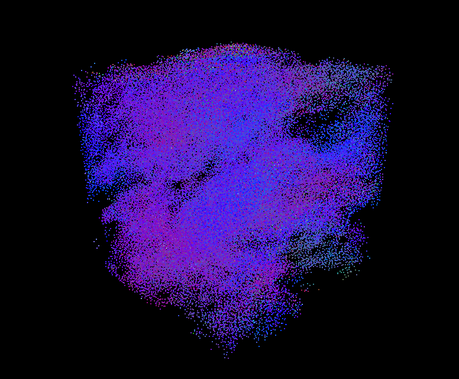

# CuBoids
Simulating an unreasonable number of flocking boids on CUDA

This project is primarly based on University of Pennsylvania's CIS 5650 Boids flocking simulation Assignment

Our goal is to simulate the behavior of flocking boids whos movement follows three simple rules:
1. Rule 1: (Cohesion) Boids try to fly towards the centre of mass of neighbouring boids.
2. Rule 2: (seperation) Boids try to keep a small distance away from other objects (including other boids).
3. Rule 3: (alignment) Boids try to match velocity with near boids.

That is, the behavior of every boid is dependent on its neighbors. Our goal is to find a method to find these neighbors efficiently to avoid an expensive (N^2) calculation
The Naive solution does the following:
```
For each boid b1
    for each other boid b2
        for each of the three rules
            check if distance (b1,b2) < the distance threshold for each rule
                apply the rule and update b1's velocity accordingly
```

performing this on a massively parallel GPU gives an "okay" performance, but certainly does not make full use of it
The optimized procedure assumes a fixed grid size
procedure:
1. We divide the grid into N cells
2. We map each boid to the cell that it is currently in
3. we perform a key-value sort in parallel using `Thrust` where the key is the cell index and the value is the boid's index 
4. We can now efficiently determine the neighboring cells of each boid by selecting the 27 cells that encompass it
5. Now we apply the same three rules between the current boid and only the boids that are within the sorrounding 27 cells to this boid

Performing this immediately yeilds some 300x speed up. More importantly, our runtime is no longer quadratic so we can simulate much more boids before the simulation becomes too slow.

We can go a step further by ensuring memory accesses are coherent.
In our earlier procedure, we have seperate buffers. One to get the index of the boid, another to get the position of the Boid based on its index, and a third gets its velocity based on its index
This means that while our boid array is sorted, accessing a specific boid's velocity or position requires first getting its index from the index array
More importantly, these accesses are scattered across each buffer so we cannot make use of memory coalescing. (the GPU fetches a chunk of memory at a time)
to resolve this, we perform a shuffling step after sorting, which sorts the position and velocity buffers based on the already sorted index buffer. 

This also yeilds about a 1.5x speedup over our last optimization.

 

### build instructions
* requires CMAKE and CUDA toolkit < 12.9


1. Create a build directory: mkdir build
2. Navigate into that directory: cd build
3. Open the CMake GUI to configure the project: `cmake-gui ..` 
4. Click Configure.
Select your Visual Studio version (2019 or 2017), and x64 for your platform. 
5. Click Generate.
6. If generation was successful, there should now be a Visual Studio solution (.sln) file in the build directory that you just created. Open this with Visual Studio.
7. Build and run.